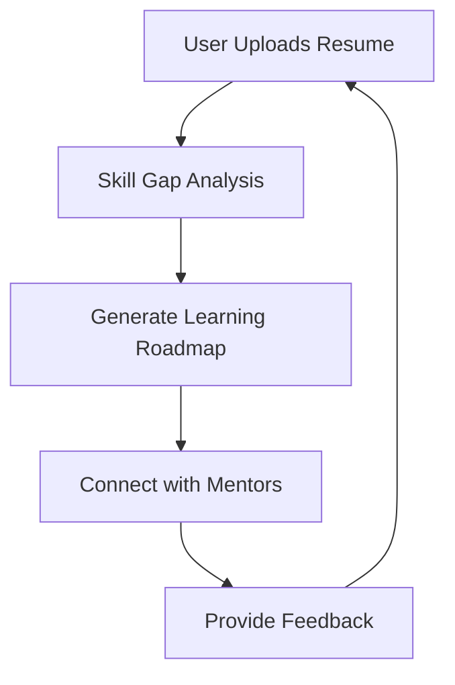

# StepUpYourCareer.AI Technical Documentation

### Objective & Scope

#### Goals
The primary goal of the StepUpYourCareer.ai project is to provide an AI-powered career assistant that aids students and job seekers in identifying skill gaps, generating personalized learning roadmaps, and connecting with industry mentors through a streamlined resume upload process [the README.md:1-29]. The system aims to enhance the employability of graduates by offering insights into the skills required by employers and facilitating efficient upskilling [the README.md:1-29]. 

Key objectives include:
- **Skill Gap Analysis**: The application analyzes user-uploaded resumes to identify missing skills relevant to their target roles [the Skill_Gap_Analysis_and_Action_Plan_Generation.ipynb:cell_22].
- **Personalized Learning Roadmaps**: Users receive tailored action plans that outline the necessary steps to bridge their skill gaps, including relevant resources [the app.py:188-268].
- **Mentorship Connection**: The platform connects users with industry mentors based on their identified skill gaps and career aspirations [the README.md:1-29].

#### Out of Scope
The current implementation does not include features for real-time job application tracking or direct job placement services [Information not available in repository]. Additionally, the project does not provide comprehensive career counseling or interview preparation services, focusing instead on skill gap analysis and resource provision [Information not available in repository]. The integration of external job market data for dynamic skill demand analysis is also not included in the current scope [Information not available in repository].

---

# System Architecture

## 1. System Architecture Diagram


*(Inferred from code)*

## 2. Key Components Table

| Component                     | Responsibility                                           | Technology                     | Evidence                                      |
|-------------------------------|---------------------------------------------------------|--------------------------------|----------------------------------------------|
| User Interface                 | Allows users to upload resumes and view results        | Streamlit                      | [the README.md:1-29]                        |
| Skill Gap Analysis             | Analyzes uploaded resumes to identify skill gaps       | OpenAI, Pandas, Scikit-learn   | [the Skill_Gap_Analysis_and_Action_Plan_Generation.ipynb:cell_3] |
| Learning Roadmap Generation    | Generates personalized learning plans based on analysis | Python, Numpy                  | [the app.py:188-268]                        |
| Mentor Connection              | Connects users with industry mentors                    | Python                          | [the README.md:1-29]                        |
| Data Processing                | Processes job descriptions and skills                   | Pandas, Scikit-learn           | [the Job_Description_JD_Manupulation.ipynb:cell_3] |
| Embedding Generation           | Generates embeddings for text input                     | OpenAI API                     | [the app.py:60-62]                          |

## 3. Detailed Explanation

The system begins with the **User Interface**, where users upload their resumes. This action triggers the **Skill Gap Analysis** component, which utilizes the OpenAI API to analyze the resume and identify missing skills relevant to the job market. The analysis is performed using data processing libraries such as Pandas and Scikit-learn, which facilitate the manipulation and evaluation of the data.

Once the skill gaps are identified, the **Learning Roadmap Generation** component constructs a personalized learning plan. This plan is based on the identified gaps and includes relevant resources, which are extracted using the `extract_rag` function from the code [the app.py:188-268]. The function organizes skills into categories and matches them with available resources.

The system also includes a **Mentor Connection** feature, which allows users to connect with industry mentors who can provide guidance and support. This component is crucial for enhancing the user's learning journey and ensuring they have access to real-world insights.

An illustrative example of the data flow can be seen in the output of the skill gap analysis, which may return a JSON object containing the identified skills and corresponding resources.

```json
{
  "skills": {
    "Python": "Resource Link",
    "Data Analysis": "Resource Link"
  }
}
```
*(Inferred from LLM based on repository content)*

## 4. Deployment View

The deployment topology likely consists of a local development setup using Streamlit for the user interface, with potential staging and production environments hosted on cloud platforms. The system's reliance on external APIs (OpenAI) suggests that it may also require secure API key management in production environments. (Inferred from LLM based on repository content)

## 5. Scalability & Reliability

The system is designed to scale by leveraging cloud services for hosting and processing. The use of libraries like Pandas and Scikit-learn allows for efficient data handling, which can be optimized further as user demand increases. However, the reliance on external APIs for embedding generation may introduce bottlenecks if not managed properly. (Inferred from LLM based on repository content)

## 6. Security & Compliance

The system incorporates basic security measures, such as API key management for the OpenAI service, which is essential for protecting user data and ensuring compliance with data protection regulations. However, further details on user authentication and data encryption are not available in the repository. (Information not available in repository)

---

# Technologies Used

## Languages
- Python

## Frameworks
- Streamlit [the requirements.txt:1]
- OpenAI [the requirements.txt:2]

## Key Libraries
- PyPDF2 [the requirements.txt:3]
- Pandas [the requirements.txt:4, the Skill_Gap_Analysis_and_Action_Plan_Generation.ipynb:cell_2]
- Scikit-learn [the requirements.txt:5]
- NumPy [the requirements.txt:6]
- TQDM [the requirements.txt:7]
- Joblib [the requirements.txt:8]

---

# Installation & Setup

This section provides detailed instructions for installing and setting up the StepUpYourCareer.ai application, including prerequisites, environment setup, and installation steps.

## Prerequisites

Before proceeding with the installation, ensure that the following prerequisites are met:

1. **Python**: Ensure that Python 3.7 or higher is installed on your system. You can download it from the official [Python website](https://www.python.org/downloads/) (Included from contextual knowledge, not from repository).
2. **Pip**: Ensure that pip, the package installer for Python, is installed. It typically comes bundled with Python installations.
3. **Google Drive Access**: If you plan to save models or data to Google Drive, ensure you have access to a Google account and the Google Drive API is enabled (Information not available in repository).

## Environment Setup

To set up the environment for the application, follow these steps:

1. **Clone the Repository**: Clone the repository to your local machine using the following command:
   ```bash
   git clone <repository-url>
   ```
   Replace `<repository-url>` with the actual URL of the repository (Information not available in repository).

2. **Navigate to the Project Directory**: Change into the project directory:
   ```bash
   cd <project-directory>
   ```
   Replace `<project-directory>` with the name of the cloned repository (Information not available in repository).

3. **Create a Virtual Environment** (optional but recommended): It is advisable to create a virtual environment to manage dependencies:
   ```bash
   python -m venv venv
   source venv/bin/activate  # On Windows use `venv\Scripts\activate`
   ```

4. **Install Required Packages**: Install the necessary packages using pip. Run the following command:
   ```bash
   pip install -r requirements.txt
   ```
   This command installs all the dependencies listed in the `requirements.txt` file [the requirements.txt:1-9].

## Installation Steps

Follow these steps to complete the installation:

1. **Run the Application**: Start the application by executing the following command:
   ```bash
   streamlit run app.py
   ```
   This command launches the Streamlit application, which can be accessed via a web browser [the app.py:24-35].

2. **Mount Google Drive** (if applicable): If you intend to save models to Google Drive, include the following code in your notebook or script to mount Google Drive:
   ```python
   from google.colab import drive
   drive.mount('/content/drive')
   ```
   This allows the application to save files directly to your Google Drive [the ClusteringMentorModelTraining.ipynb:cell_12].

3. **Upload Files**: If your application requires file uploads, use the following code snippet to handle file uploads:
   ```python
   from google.colab import files
   uploaded = files.upload()
   ```
   This will prompt the user to upload files necessary for the application [the Job_Description_JD_Manupulation.ipynb:cell_6].

4. **Access the Application**: Open your web browser and navigate to the URL provided in the terminal after running the Streamlit command. This will direct you to the StepUpYourCareer.ai interface.

By following these steps, you will have successfully installed and set up the StepUpYourCareer.ai application.

---

# API & Environment Variables

## API Endpoints

| Method | Path                     | Summary                                                                 |
|--------|--------------------------|-------------------------------------------------------------------------|
| POST   | /extract_json            | Extracts JSON from a raw response string.                              |
| POST   | /get_skill_priorities    | Retrieves skill priorities based on a target role using GPT-4o-mini.   |
| POST   | /retrieve_examples        | Retrieves top-k examples based on a query using cosine similarity.      |

## Environment Variables

| Variable        | Purpose                                      |
|-----------------|----------------------------------------------|
| `OPENAI_API_KEY`| API key for accessing OpenAI services.      |