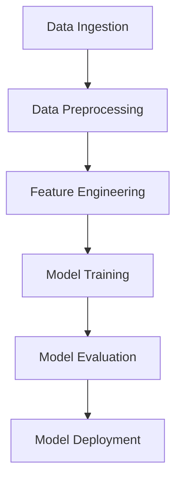

# loan-approval-ml Technical Documentation

### Objective & Scope

The objective of this project is to develop a robust credit risk modeling system that accurately predicts the probability of default (PD) for customers. This system will leverage various machine learning techniques and data analysis methods to enhance decision-making processes in financial institutions.

### Goals

1. **Credit Risk Prediction**: The primary goal is to create a predictive model that estimates the likelihood of a customer defaulting on a loan. This involves training various machine learning models, including regression and classification algorithms, to achieve high accuracy and reliability in predictions [the Modelling.ipynb:cell_8].

2. **Data Analysis and Exploration**: Conduct thorough exploratory data analysis (EDA) to understand the underlying patterns and relationships within the dataset. This includes generating crosstabs and visualizations to identify trends related to different demographic and financial factors [the eda.ipynb:cell_115, the eda.ipynb:cell_119].

3. **Feature Engineering**: Implement feature engineering techniques to enhance model performance. This includes handling missing values, encoding categorical variables, and scaling numerical features to ensure that the models can effectively learn from the data [the Data Cleaning.ipynb:cell_5, the Data_Cleaning -checkpoint.ipynb:cell_12].

4. **Model Evaluation and Selection**: Evaluate multiple models based on performance metrics such as recall and precision, ensuring that the selected model meets the project's requirements for accuracy and interpretability [the SVM.ipynb:cell_21, the Modelling.ipynb:cell_9].

5. **Integration with MLflow**: Utilize MLflow for tracking experiments, managing model versions, and storing artifacts. This will facilitate better collaboration and reproducibility of results throughout the project lifecycle [the meta.yaml:1-7].

### Out of Scope

1. **Real-time Prediction**: The current project does not include the implementation of real-time prediction capabilities. The focus is solely on model development and evaluation using historical data [Information not available in repository].

2. **Deployment**: The deployment of the model into a production environment is not covered in this project. The primary aim is to develop and validate the model rather than to integrate it into existing systems [Information not available in repository].

3. **Comprehensive Financial Analysis**: While the project includes credit risk modeling, it does not encompass a full financial analysis of the lending institution or its broader economic implications [Information not available in repository].

4. **User Interface Development**: The creation of a user interface for end-users to interact with the model is outside the scope of this project. The focus remains on backend model development and analysis [Information not available in repository].

---

# System Architecture

## 1. System Architecture Diagram



*Title: Core System Architecture Flow (Based on repository content)*

## 2. Key Components Table

| Component           | Responsibility                                  | Technology                 | Evidence                                  |
|---------------------|------------------------------------------------|----------------------------|-------------------------------------------|
| Data Ingestion       | Collects raw data from various sources          | SQL, Pandas                | [application_with_history.sql:1-11]       |
| Data Preprocessing   | Cleans and transforms data for modeling         | Pandas, Scikit-learn       | [preprocessing_util.py:28-59]              |
| Feature Engineering  | Creates features for model training              | SQL, Scikit-learn          | [prev_application_view.sql:1-13], [Modelling.ipynb:cell_0] |
| Model Training      | Trains machine learning models                    | Scikit-learn, XGBoost      | [Modelling.ipynb:cell_8]                   |
| Model Evaluation    | Assesses model performance                         | Scikit-learn               | [Modelling.ipynb:cell_8]                   |
| Model Deployment    | Manages model lifecycle and deployment             | MLflow                     | [meta.yaml:1-19]                           |

## 3. Detailed Explanation

The system architecture supports a credit risk modeling workflow with the following stages:

1. **Data Ingestion**: Raw data is ingested from multiple sources, including current and previous loan application datasets, combined via SQL views to enrich the feature set ([application_with_history.sql:1-11], [prev_application_view.sql:1-13]).

2. **Data Preprocessing**: Data transformations include logarithmic scaling and standardization applied selectively to columns, implemented in `get_transformers` within `preprocessing_util.py` ([preprocessing_util.py:28-59]).

3. **Feature Engineering**: Features are engineered by aggregating historical application data and preparing inputs for modeling pipelines ([prev_application_view.sql:1-13], [Modelling.ipynb:cell_0]).

4. **Model Training**: Multiple models, including logistic regression and XGBoost classifiers, are trained using cross-validation and hyperparameter tuning techniques ([Modelling.ipynb:cell_8]).

5. **Model Evaluation**: Model performance is evaluated with standard classification metrics such as precision, recall, and F1 score, using Scikit-learn utilities ([Modelling.ipynb:cell_8]).

6. **Model Deployment**: Trained models are registered and managed via MLflow, which tracks model versions and artifacts ([meta.yaml:1-19]).

## 4. Additional Components

- **API for Predictions**: The repository does not contain explicit implementation or configuration for an API layer. While FastAPI or similar frameworks are common for serving models, no direct evidence is present.

- **User Interface**: No user interface code or artifacts are found in the repository; thus, no confirmation of a frontend component can be made.

## 5. Deployment and Scalability

The repository includes MLflow for model lifecycle management, which facilitates deployment and version control. However, details on deployment environments, cloud infrastructure, or scaling strategies are not provided.

## 6. Security Considerations

Security practices are not explicitly documented. The use of environment variables for API keys in the report generation notebook ([LLM report generation.ipynb:cell_0]) indicates some handling of sensitive information, but no further security or compliance details are available.

---

# Technologies Used

## Languages
- Python 3.13.5 [the python_env.yaml:1-8]

## Frameworks
- Streamlit [the requirements.txt:1-18]
- MLflow [the requirements.txt:1-18]

## Key Libraries
- NumPy [the requirements.txt:1-18]
- Pandas [the requirements.txt:1-18]
- Matplotlib [the requirements.txt:1-18]
- Seaborn [the requirements.txt:1-18]
- SciPy [the requirements.txt:1-18]
- Scikit-learn [the requirements.txt:1-18]
- Openpyxl [the requirements.txt:1-18]
- SQLAlchemy [the requirements.txt:1-18]
- Python-dotenv [the requirements.txt:1-18]
- Joblib [the requirements.txt:1-18]
- Imbalanced-learn (imblearn) [the requirements.txt:1-18]
- Statsmodels [the requirements.txt:1-18]
- SHAP [the requirements.txt:1-18]
- XGBoost [the requirements.txt:1-18]
- Hugging Face Hub [the requirements.txt:1-18]
- PyODBC [the requirements.txt:1-18]

---

# Installation & Setup

This section provides a comprehensive guide for installing and setting up the project, including prerequisites, environment setup, and installation steps.

## Prerequisites

Before proceeding with the installation, ensure that the following prerequisites are met:

- **Python Version**: Python 3.13.5 is required [the python_env.yaml:1-8].
- **Build Dependencies**: The following build dependencies must be installed:
  - `pip==25.0.1`
  - `setuptools==80.8.0`
  - `wheel` [the python_env.yaml:1-8].
- **Required Packages**: The project requires several Python packages, which are listed in the `requirements.txt` file [the requirements.txt:1-18].

## Environment Setup

To set up the environment, follow these steps:

1. **Create a Virtual Environment**: It is recommended to create a virtual environment to manage dependencies. You can create one using the following command:
   ```bash
   python -m venv loan_approval_env
   ```

2. **Activate the Virtual Environment**:
   - On Windows:
     ```bash
     loan_approval_env\Scripts\activate
     ```
   - On macOS/Linux:
     ```bash
     source loan_approval_env/bin/activate
     ```

3. **Install Required Packages**: Install the required packages using the `requirements.txt` file:
   ```bash
   pip install -r requirements.txt
   ```

4. **Set Up Environment Variables**: Create a `.env` file in the project root directory to store sensitive information such as API keys. The file should include the following line:
   ```
   OPENAI_API_KEY=your_api_key_here
   ```
   Replace `your_api_key_here` with your actual OpenAI API key [the LLM report generation.ipynb:cell_0].

## Installation Steps

Follow these steps to complete the installation:

1. **Clone the Repository**: Clone the project repository to your local machine using:
   ```bash
   git clone <repository_url>
   ```

2. **Navigate to the Project Directory**:
   ```bash
   cd <project_directory>
   ```

3. **Install the Project Dependencies**: Ensure all dependencies are installed as specified in the `requirements.txt` file:
   ```bash
   pip install -r requirements.txt
   ```

4. **Verify Installation**: To verify that the installation was successful, you can run a sample script or check the installed packages:
   ```bash
   pip list
   ```

By following these steps, you will have a fully functional environment set up for the project.

---

# API & Environment Variables

## API Endpoints

| Method | Path               | Summary                                                                 |
|--------|--------------------|-------------------------------------------------------------------------|
| POST   | /chat/completions   | Generates chat completions using the OpenAI API with a specified model. |

## Environment Variables

| Variable           | Purpose                                      |
|--------------------|----------------------------------------------|
| OPENAI_API_KEY     | API key for authenticating with the OpenAI service. |